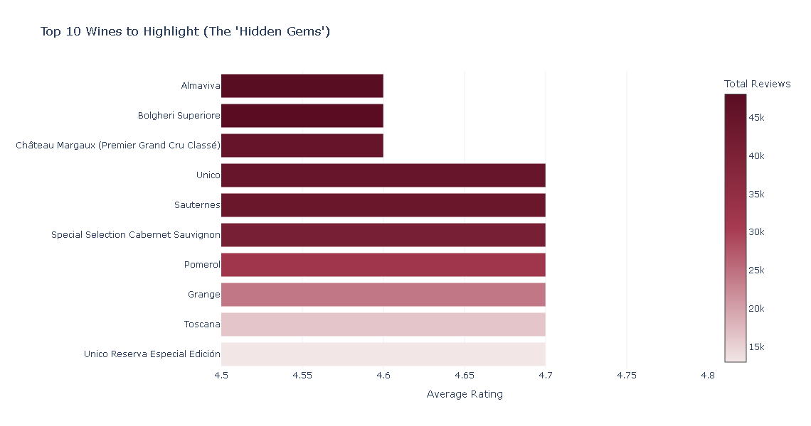
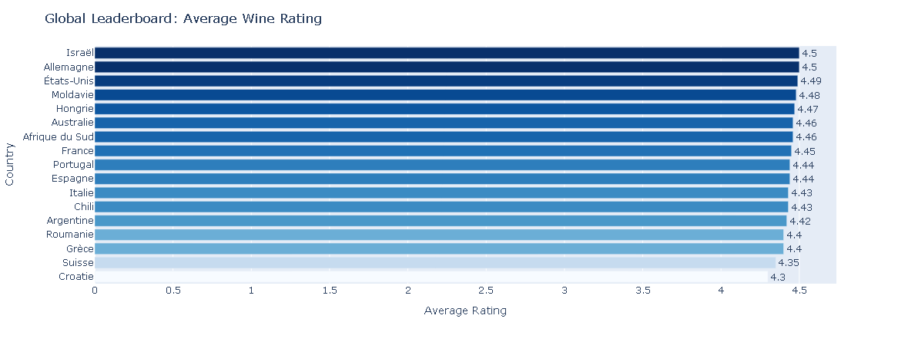
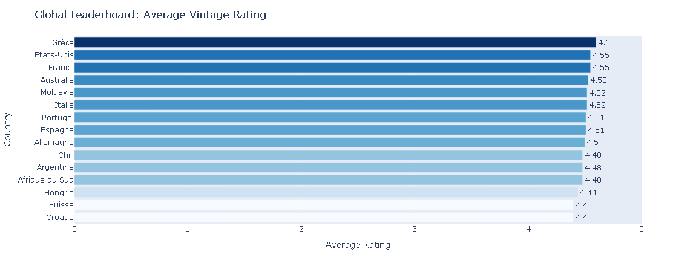

# Vivino Market Analysis


## Overview
Analysis of the Vivino wine market dataset to answer stakeholders business questions.

## Project Structure
```
Vivino_market_analysis/
├── data/             # Dataset files
├── notebooks/        # Jupyter notebooks for analysis
├── queries/          # SQL queries
├── src/              # Python scripts and utilities
├── reports/          # Generated charts and plots
├── README.md         # This file
└── requirements.txt  # List of libraries used 
```

## Objectives
- Analyze wine pricing and ratings
- Identify market trends
- Explore geographical and varietal patterns
- Generate actionable business insights

## Data Sources
- vivino.db - Vivino wine dataset

## Technologies Used
- Python
- SQL
- Pandas (for dataframe in visual only)
- Plotly
- Jupyter Notebook

## Installation
```bash
pip install -r requirements.txt
```

## Usage

1. **Data Setup:** Ensure the Vivino database is loaded in the `data/` directory.
2. **Launch Environment:** You can run this project using your preferred workflow:

   * **Option A: VS Code / IDEs**
     Open the project folder in VS Code, install the Python/Jupyter extensions, open any `.ipynb` file in the `notebooks/` directory, and click "Run All".
   
   * **Option B: Terminal (Universal)**
     Start the environment directly from your command line:
     ```bash
     jupyter notebook
     ```
     This will open a browser window. Navigate to the `notebooks/` directory to open the files

3. **Run Analysis:** The notebooks will automatically execute the SQL scripts from the `queries/` folder and render the interactive Plotly visualizations using the reusable functions defined in `src/visualizations.py`.


## Visuals




## Key Findings

 Architectural Data Flaw (Many-to-Many Duplication)
 
 During the analysis of wine-to-grape relationships, a significant architectural limitation was identified in the database schema:
 
 The Issue: There is no direct junction table linking wines to grapes. Instead, the data is connected via a geographic proxy: wines -> countries -. most_used_grapes_per_country.
 
 The Mechanics: Because the link is geographic rather than ingredient-based, the SQL engine assumes that every wine from a specific country contains all of that country's most popular grapes.
 
 The Result: This leads to "Phantom Duplication." For example, a wine literally named Cabernet Sauvignon is incorrectly listed as a top wine for Chardonnay simply because both are top grapes in the same country.
 
 Architectural Recommendation: In a production environment, this schema would be rejected. A specific wine_grapes junction table linking wine_id directly to grape_id is required to ensure ingredient-level accuracy and prevent many-to-many fan-out.

## Author
Mohamed Toukane  
